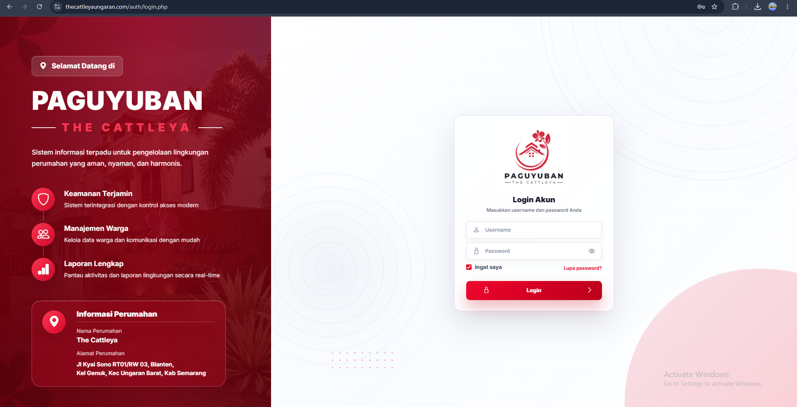
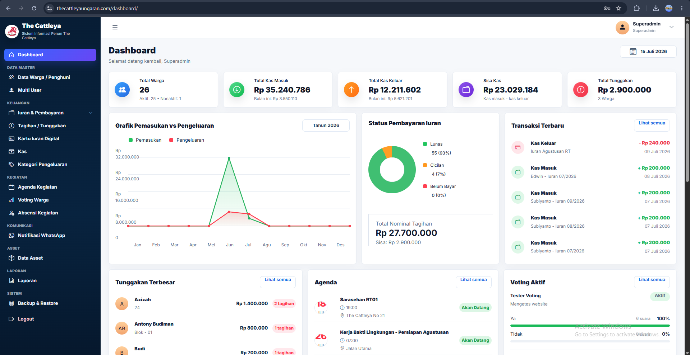

<div align="center">

# 🏘️ RT/RW Management System

### Enterprise Community Management Platform

Modern web-based platform for digitalizing RT/RW administration, resident management, financial operations, communication, and community services.

<p>


</p>

---

> **Professional Portfolio Showcase**  
> This repository demonstrates an enterprise RT/RW management platform developed for residential communities.  
> The complete source code is intentionally kept private because it contains proprietary business logic and client-specific implementations.

</div>

---

# 📸 Application Preview

## 🔐 Secure Login

A modern authentication page with responsive layout, clean interface, and secure access for administrators.

<p align="center">

</p>

---

## 📊 Executive Dashboard

A centralized dashboard providing real-time operational insights including:

- Resident Statistics
- Financial Summary
- Cash Flow
- Outstanding Contributions
- Community Agenda
- Voting Status
- Attendance Monitoring
- Recent Transactions
- Analytical Charts

<p align="center">

</p>

---

# 🚀 Platform Overview

The RT/RW Management System is an integrated enterprise platform built to modernize residential community administration.

The application centralizes resident management, contribution collection, financial reporting, digital community services, communication, and operational activities into a single unified system.

Designed with scalability and maintainability in mind, the platform enables administrators to efficiently manage daily operations while improving transparency and service quality for residents.

---

# ✨ Core Features

### 👥 Resident Management

- Resident Database
- Family Card Management
- Resident Status
- Occupancy Management
- Search & Filtering

---

### 💰 Financial Management

- Contribution Collection
- Outstanding Payments
- Cash Book
- Expense Categories
- Financial Reports
- Monthly Recap

---

### 💳 Digital Contribution Card

- Resident Contribution Card
- Payment History
- Outstanding Tracking
- Monthly Billing

---

### 📄 Letter Management

- Automatic Letter Generation
- Letter Templates
- Digital Archive
- Printable Documents

---

### 📅 Community Activities

- Agenda Management
- Attendance
- Community Voting
- Event Scheduling

---

### 📢 Communication

- WhatsApp Notification
- Resident Announcement
- Broadcast Information

---

### 🏢 Asset Management

- Asset Inventory
- Asset Monitoring
- Asset Documentation

---

### 📈 Reporting

- Financial Reports
- Resident Reports
- Excel Export
- Printable Reports

---

### 💾 System Utilities

- Multi User
- Role Management
- Backup & Restore
- Authentication
- Activity Monitoring

---

# 👥 User Roles

| Role | Description |
|------|-------------|
| Super Administrator | Full system management |
| RT/RW Administrator | Daily operational management |
| Treasurer | Financial management |
| Staff | Administrative operations |
| Resident | Resident Portal |

---

# 🛠 Technology Stack

- PHP
- MySQL
- Bootstrap
- JavaScript
- AJAX
- AdminLTE
- Chart.js
- SweetAlert
- WhatsApp Gateway
- Responsive Web Design

---

# 🏗 System Architecture

```text
Residents
        │
        ▼
 Authentication
        │
        ▼
 Business Logic
        │
        ▼
 MySQL Database
        │
        ├── Financial Module
        ├── Resident Module
        ├── Communication Module
        ├── Reporting Module
        └── Administration Module
```

---

# 🔒 Security

- Authentication
- Multi Role Authorization
- Session Management
- Data Validation
- Secure Backup
- Access Control

---

# 📈 Future Roadmap

- Mobile Application
- QR Attendance
- Online Payment Gateway
- REST API
- Digital Signature
- Cloud Deployment
- Resident Mobile Portal

---

# ⚠️ Source Code

This repository is intended for professional portfolio purposes only.

The complete source code is **private** because it contains proprietary business logic, confidential implementation details, and client-specific customizations.

This repository showcases the application's capabilities, user interface, and overall architecture without exposing confidential intellectual property.

---

<div align="center">

### ⭐ Enterprise Community Management Platform

**Building smarter, safer, and more connected residential communities through technology.**

</div>
