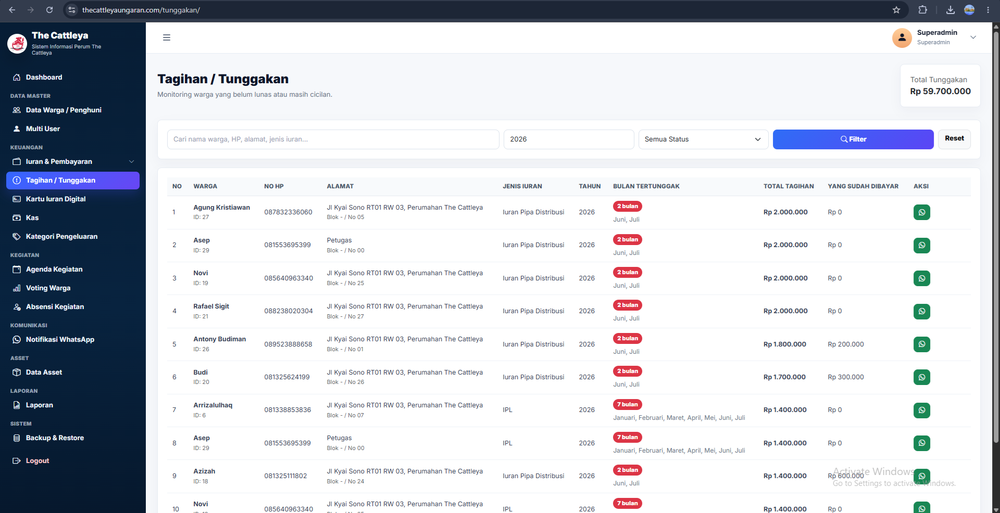
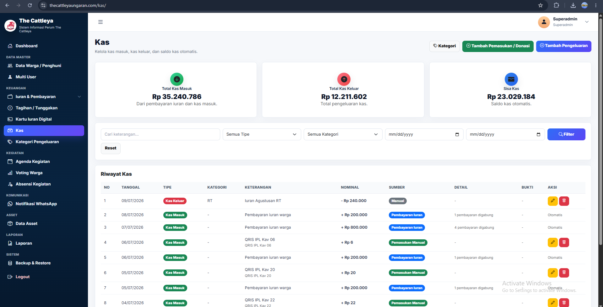
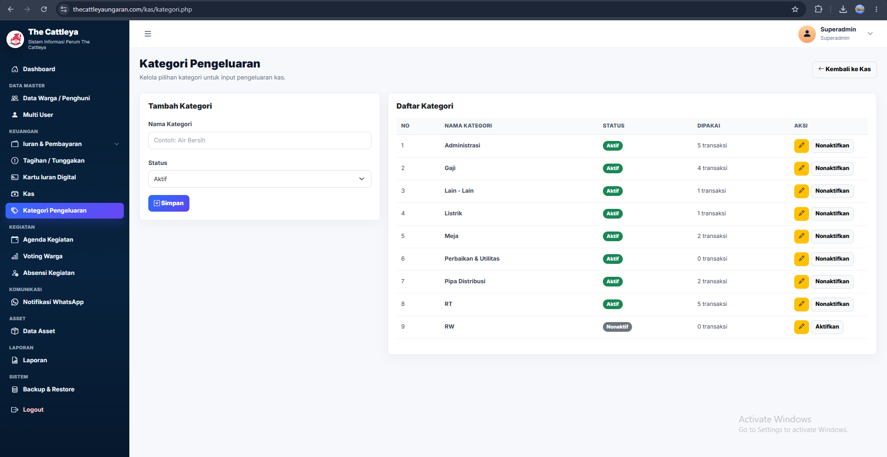
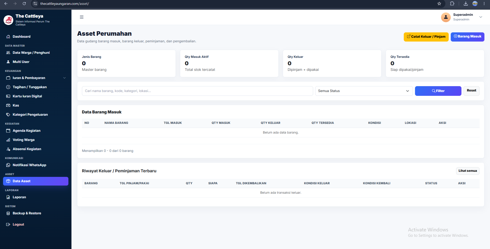
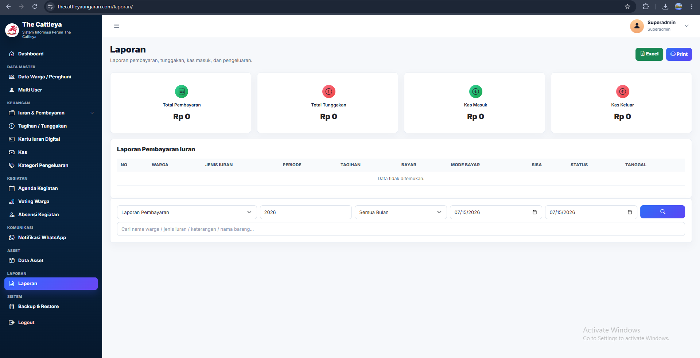

<div align="center">

# 🏘️ RT/RW Enterprise Community Management System

### Residents • Contributions • Finance • Activities • Communication • Assets • Reporting

A complete digital platform for modernizing residential-community administration, improving financial transparency, and delivering better services to residents.

<p>
  
  
  
  
  
</p>

</div>

---

## 📚 Table of Contents

- [Live Demo](#-live-demo)
- [Platform Overview](#-platform-overview)
- [Business Problems Solved](#-business-problems-solved)
- [Core Modules](#-core-modules)
- [Complete Application Gallery](#-complete-application-gallery)
- [Business Workflow](#-business-workflow)
- [Technology Stack](#-technology-stack)
- [Security & Reliability](#-security--reliability)
- [Source Code Notice](#️-source-code-notice)

---

## 🌐 Live Demo

**Demo Website:**  
https://iuranrt.loveslife.biz/rt_rw_part2

```text
Username : superadmin
Password : superadmin
```

> Demo data may be reset periodically. Please avoid deleting essential records or changing the demonstration credentials.

---

## 🚀 Platform Overview

RT/RW Enterprise Community Management System is a web-based platform designed to centralize daily neighborhood administration.

The application combines resident records, contribution billing, payment tracking, financial management, digital contribution cards, community agendas, resident voting, activity attendance, WhatsApp communication, asset management, reporting, and database protection in one integrated system.

The platform helps RT/RW administrators replace fragmented spreadsheets and manual records with transparent, traceable, and service-oriented digital workflows.

---

## 🎯 Business Problems Solved

- Manual resident records spread across paper documents and spreadsheets
- Difficult contribution collection and arrears monitoring
- Limited financial transparency for residents and administrators
- Repetitive manual reminders through personal messaging
- Unstructured community activity and attendance records
- Slow voting and decision-making processes
- Poor visibility of community assets and borrowing history
- Risk of data loss without structured backup procedures
- Time-consuming monthly and operational reporting

---

## ✨ Core Modules

| Module | Main Purpose |
|---|---|
| Resident Management | Maintain resident and household administrative data |
| Contribution Types | Configure recurring and one-time community fees |
| Payments | Record, validate, and review contribution payments |
| Arrears | Monitor unpaid bills and resident outstanding balances |
| Digital Contribution Card | Give residents a transparent contribution history |
| Cash & Expenses | Track income, expenditure, and community balances |
| Agenda | Organize upcoming community activities |
| Voting | Support transparent resident participation and decisions |
| Attendance | Record and monitor event participation |
| WhatsApp Notifications | Send reminders, notices, and community broadcasts |
| Asset Management | Track assets, borrowing, returns, and availability |
| Reports & Export | Produce operational and financial summaries |
| Backup & Restore | Protect data and support system recovery |

---

## 📸 Complete Application Gallery


### Secure Administration Login

<p align="center">
  
</p>

A clean and responsive authentication page for administrators and authorized community officers.

---


### Executive Community Dashboard

<p align="center">
  
</p>

A real-time operational dashboard showing resident statistics, cash position, contribution status, arrears, recent transactions, agendas, and active voting.

---


### Resident Data Management

<p align="center">
  
</p>

Centralized resident records for managing identities, occupancy status, household information, and administrative data.

---


### Contribution Type Management

<p align="center">
  
</p>

Configurable contribution categories used to define recurring or one-time community fees.

---


### Contribution Payment Entry

<p align="center">
  
</p>

Payment-entry workflow for recording resident contributions accurately and efficiently.

---


### Payment Detail & Validation

<p align="center">
  
</p>

Detailed payment processing with resident, period, amount, and transaction validation.

---


### Outstanding Contribution Tracking

<p align="center">
  
</p>

Outstanding-payment monitoring that helps administrators identify unpaid contributions and follow up with residents.

---


### Digital Contribution Card — Overview

<p align="center">
  
</p>

Digital contribution card summarizing billing periods, payment status, and resident contribution records.

---


### Digital Contribution Card — Payment History

<p align="center">
  
</p>

Historical payment view for transparent resident contribution tracking.

---


### Digital Contribution Card — Detailed Status

<p align="center">
  
</p>

Detailed digital billing and contribution status for every resident account.

---


### Community Cash Management

<p align="center">
  
</p>

Community cashbook for tracking incoming funds, balances, and financial movement.

---


### Expense Management

<p align="center">
  
</p>

Expense-recording module for operational spending, categories, descriptions, and accountability.

---


### Community Agenda

<p align="center">
  
</p>

Community event scheduling with dates, locations, status, and activity information.

---


### Resident Voting Results

<p align="center">
  
</p>

Transparent digital voting results for community decisions and resident participation.

---


### Activity Attendance

<p align="center">
  
</p>

Attendance view for monitoring participation in community activities.

---


### Attendance Administration

<p align="center">
  
</p>

Administrative attendance management for recording, updating, and reviewing participant presence.

---


### WhatsApp Notification Center

<p align="center">
  
</p>

WhatsApp communication center for reminders, contribution notices, and community information.

---


### WhatsApp Broadcast & Templates

<p align="center">
  
</p>

Broadcast and template management for consistent resident communication through WhatsApp.

---


### Community Asset Management

<p align="center">
  
</p>

Community asset inventory for tracking ownership, borrowing, returns, condition, and availability.

---


### Reports & Export

<p align="center">
  
</p>

Filterable operational and financial reports with export support for administrative review.

---


## 🔄 Business Workflow

```text
Resident Registration
        │
        ▼
Contribution Configuration
        │
        ▼
Billing & Payment Recording
        │
        ├── Digital Contribution Card
        ├── Outstanding / Arrears Monitoring
        └── WhatsApp Reminder
        │
        ▼
Cash & Expense Management
        │
        ▼
Community Activities
        ├── Agenda
        ├── Voting
        └── Attendance
        │
        ▼
Asset Administration
        │
        ▼
Reports & Export
        │
        ▼
Backup & Restore
```

---

## 👥 User Roles

The application supports role-oriented operational access, including:

- Super Administrator
- RT/RW Administrator
- Treasurer
- Administrative Staff
- Resident Portal User

Access can be adjusted according to organizational duties and data responsibilities.

---

## 💻 Technology Stack

### Backend

- PHP
- MySQL
- Server-side business logic
- Session-based authentication

### Frontend

- HTML5
- CSS3
- Bootstrap
- JavaScript
- AJAX
- Responsive admin dashboard
- Chart-based operational summaries

### Integrations & Output

- WhatsApp notification workflows
- Excel report export
- Printable contribution records
- Database backup and restore

---

## 🔒 Security & Reliability

- Protected administration login
- Role-based access control
- Session management
- Server-side input validation
- Controlled financial workflows
- Traceable resident and transaction records
- Database backup and recovery support

---

## 📈 Business Value

- Improves transparency of resident contributions and community cash
- Reduces manual administrative work
- Gives administrators faster access to resident information
- Simplifies payment and arrears follow-up
- Strengthens communication through structured WhatsApp notifications
- Supports transparent community voting
- Tracks activities, attendance, and assets in one platform
- Produces faster and more reliable operational reports

---

## ⚠️ Source Code Notice

This public repository is intended for **professional portfolio and product-showcase purposes only**.

The complete source code is private because it contains proprietary business logic, client-specific implementation details, and protected configurations. Screenshots, documentation, and demo access are provided to demonstrate the application's functionality and scope without exposing confidential intellectual property.

---

## 👩‍💻 Developer

**Sari Larasati**

Senior Web Programmer & Freelance PHP Developer  
Enterprise Business Applications • Community Platforms • Finance & Reporting Systems

- GitHub: https://github.com/RASRASS18
- Email: laraskhalid@gmail.com
- Location: Mataram, West Nusa Tenggara, Indonesia

---

<div align="center">

### Smarter administration. Transparent finances. Better community services.

**Open to freelance PHP projects and remote development opportunities.**

</div>
